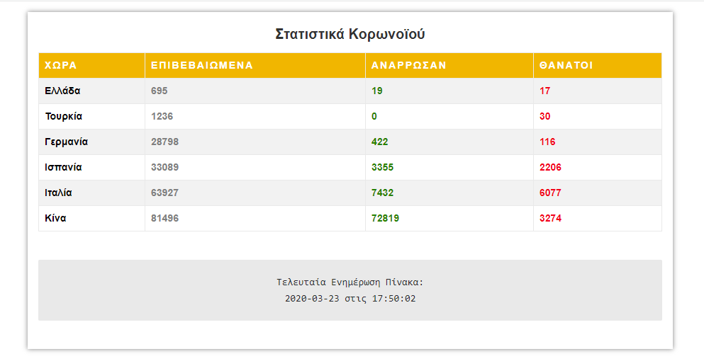

# Greek-Coronavirus-Stats-Wordpress-Plugin
> This plugin automatically reload the arrays values every time you refresh the page 

## Installation
> Upload it in your wordpress plugin directory, install it from the admin panel and add the shortcode [greek-coronavirus-stats] in a page

## Watch it live
><https://MrWebsite.gr/coronavirus>

## Contributing
1. Star it
2. Fork it (<https://github.com/Katsaros/convert-plaintext-to-hash-code/fork>)
3. Create your feature branch (`git checkout -b feature/fooBar`)
4. Commit your changes (`git commit -am 'Add some fooBar'`)
5. Push to the branch (`git push origin feature/fooBar`)
6. Create a new Pull Request
